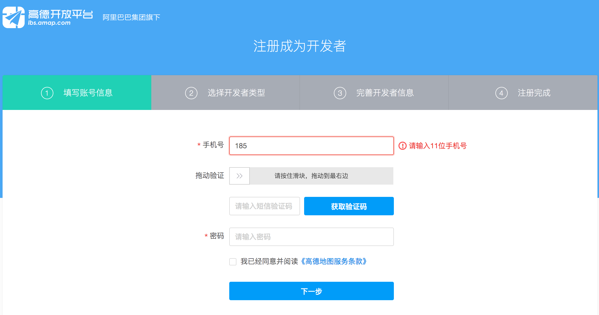

### 准备
#### 1 注册成为开发者

        http://lbs.amap.com/

#### 2 进入开发者中心控制台

#### 3 创建新应用

#### 4 添加新key

### 如何引入高德地图到你的项目

#### 1 页面直接引入

    

#### 2 异步加载

        
        

### 第一个高德地图程序  01/start.html

#### 1 在页面中引入高德地图JavaScript API入口脚本

        

#### 2 创建地图容器

        

  

#### 3 CSS 給地图容器指定大小

        #container {width:300px; height: 180px; }  

#### 4 创建地图

        var map = new AMap.Map('container');

#### 5 设定地图的中心点和级别

> 我们一般需要给地图按需设定中心点和坐标等属性，这里可以通过两种方式，第一种，直接在地图初始化的时候传入相关属性，center属性的值可以是经纬度的二元数组，也可以是AMap.LngLat对象，要求经度值在前，纬度值在后：

        var map = new AMap.Map('container',{
            zoom: 10,
            center: [116.39,39.9]//new AMap.LngLat(116.39,39.9)
        });

> 也可以在地图初始化过后，任何需要的地方通过方法来改变地图的中心点和级别

        var map = new AMap.Map('container');
        map.setZoom(10);
        map.setCenter([116.39,39.9]);

> JavaScript API提供了丰富的覆盖物，比如Marker点标记、Polyline折线、Polygon多边形、Circle圆等。以Marker为例， 我们创建一个最简单的Marker，并将它添加到地图上：

        var marker = new AMap.Marker({
            position: [116.480983, 39.989628],//marker所在的位置
            map:map//创建时直接赋予map属性
        });
        //也可以在创建完成后通过setMap方法执行地图对象
        marker.setMap(map);

### 坐标拾取器 01/tiananmen.html

> 通过坐标拾取器可以创建拾取坐标为核心的地图，比如天安门为中心的地图，拾取坐标经纬度 [116.397428, 39.90923]  ，那么只需在创建时配置参数即可

        http://lbs.amap.com/console/show/picker

        var map = new AMap.Map('container', {
                resizeEnable: true,
                zoom:11,
                center: [116.397428, 39.90923]        
        });

### 地图控件 01/controll.html

* 工具条 : ToolBar
* 比例尺 : Scale
* 定位 : Geolocation
* 鹰眼 : OverView
* 基本图层切换 : MapType

### 覆盖物
> 最常用的地图覆盖物是Marker和信息窗体，除此之外，我们提供了圆Circle、多边形Polygon、折线Polyline、右键菜单ContextMenu等。除信息窗体和右键菜单之外，这些覆盖物都可以使用setMap方法添加到地图或者从地图上移除，使用setMap()可以将覆盖物从地图中移除；信息窗体和右键菜单使用open方法显示在地图上：

* 点标记 Marker 用来在地图上添加点状标记，可指定任意icon或者content
* 信息窗体 infoWindow 用来展示比较详细或者复杂的内容，同一事件只能展示一个
* 圆 Circle 以某一中心和半径(m)在地图上绘制圆
* 多边形 Polygon 通过路径path在地图上绘制多边形，支持填充、描边以及多环多边形
* 折线 Polyline 通过路径在地图上绘制折线，支持描边以及虚线
* 右键菜单 ContentMenu 封装地图的右键菜单，鼠标右键单击时弹出

        var marker = new AMap.Marker({
            position: [116.480983, 39.989628]
        });
        marker.setMap(map);
            var circle = new AMap.Circle({
            center: [116.480983, 39.989628],
            radius: 100,
            fillOpacity:0.2,
            strokeWeight:1
        })
        circle.setMap(map);
            map.setFitView()
            var info = new AMap.InfoWindow({
            content:"信息窗体 这里是方恒科技大厦",
            offset:new AMap.Pixel(0,-28)
        })
        info.open(map,marker.getPosition())

### 图层

* TileLayer 默认图层
* TileLayer.Traffic 实时交通
* TileLayer.Statellite 卫星
* TileLayer.RoadNet 路网
* Buildings 3D楼块

> 除了默认的图层之外，API提供了路况Traffic、卫星Satellite、路网RoadNet、3D楼块Buildings等图层类，使用多图层的时候有两种方式， 第一种方式，在地图初始化的时候将需要的图层设定到layers属性中：
#### 方式一：

        var defaultLayer = new AMap.TileLayer();
        var traffic = new AMap.TileLayer.Traffic();
        var map = new AMap.Map('container',{
            zoom: 10,
            layers: [
            defaultLayer,//默认图层
            traffic//实时交通图层
            ],
            center: [116.39,39.9]
        });

#### 方式二：

> 第二种方式，在地图初始化之后，通过调用setMap(map)将图层添加到地图上，不需要的时候可以使用setMap()来移除某个图层：

        var defaultLayer = new AMap.TileLayer();
        var traffic = new AMap.TileLayer.Traffic();
        var map = new AMap.Map('container',{
            zoom: 10,
            center: [116.39,39.9]
        });
        traffic.setMap(map);

---

### 地图组件

* 网址 http://lbs.amap.com/api/lightmap/summary/

#### 1 可实现功能
* 位置标注
* 路线规划
* 周边搜索
* 选址组件
